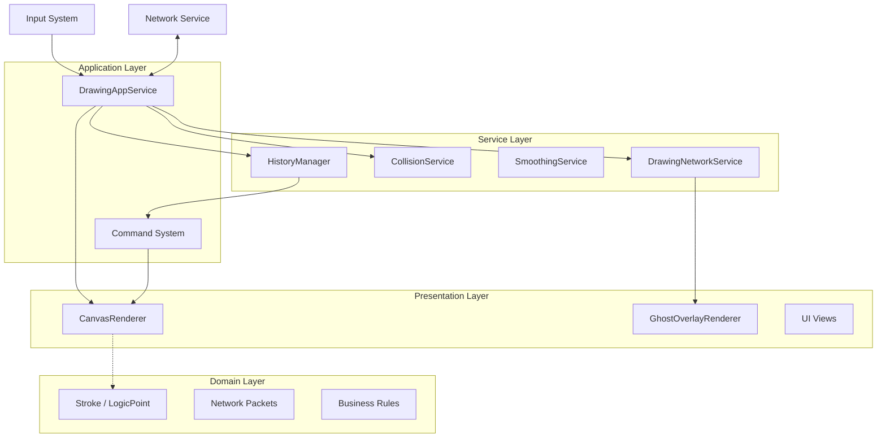

必须强制用中文回答

# Drawer Project - AI Developer Handbook

> **Role Definition**: This document serves as the primary source of truth for AI Agents (and human developers) working on the Drawer project. It defines the architectural constraints, core concepts, and coding standards that **MUST** be followed to maintain system integrity.
>
> **Maintenance Rule**: Whenever the system architecture or core patterns are modified, this file **MUST** be updated **FIRST** to reflect the changes.

## 1. Project Overview

**Drawer** is a high-performance, low-latency 2D drawing application built with Unity. It prioritizes input responsiveness, cross-resolution consistency, and robust state management.

*   **Core Goal**: Native-like writing experience with < 33ms latency.
*   **Tech Stack**: Unity 2021.3+ (LTS), C#, UGUI.
*   **Architecture**: Domain-Driven Design (DDD) with Layered Architecture.
*   **Key Constraint**: **Zero-GC** in critical paths (Update/Draw loops).

## 2. Core Concepts & Terminology

Understanding these terms is mandatory for any code modification.

| Term | Definition | Context/Usage |
| :--- | :--- | :--- |
| **LogicPoint** | A resolution-independent coordinate struct. Uses `ushort` (0-65535) for X/Y to ensure deterministic behavior across devices. | `Domain/ValueObject` |
| **Stroke** | The fundamental entity of drawing. Contains a list of `LogicPoint`s, brush ID, color, seed, and a unique ID. | `Domain/Entity` |
| **Command Pattern** | All state changes (Draw, Erase, Clear) are encapsulated as `ICommand` objects to support Undo/Redo and Serialization. | `App/Command` |
| **Spatial Index** | A grid-based spatial hashing system used to accelerate Eraser collision detection. | `Service/StrokeSpatialIndex` |
| **LogicToWorld** | The ratio converting `LogicPoint` (0-65535) to World Space (Pixels). Dynamic based on Canvas resolution. | `DrawingConstants`, `AppService` |
| **Ghost Layer** | A transient overlay layer for rendering remote strokes in real-time before they are committed to history. | `Presentation/GhostOverlayRenderer` |
| **Delta Compression** | A technique to compress stroke points by storing differences relative to the previous point. | `Service/Network/StrokeDeltaCompressor` |
| **Structured Log** | JSON-formatted logs containing `TraceId` and `Context`, enabling observability. | `Common/Diagnostics` |

## 3. System Architecture

The system follows a strict unidirectional data flow and layered separation.

### 3.1 Architecture Diagram

### 3.2 Layer Responsibilities

1.  **Presentation (Unity)**:
    *   **CanvasRenderer**: Handles `CommandBuffer`, `Mesh`, `Material`. **Purely visual**.
    *   **CanvasLayoutController**: Manages Resolution/Aspect Ratio and RenderTextures (separated from Renderer).
    *   **GhostOverlayRenderer**: Handles transient rendering of remote strokes (Red trail for eraser).
    *   **Rules**: Never put business logic here. Uses **Retained Mode** (Redraw per frame) to support prediction.
2.  **Application (App)**:
    *   **DrawingAppService**: The "Brain". Coordinates Input -> Logic -> Rendering -> Network.
    *   **Rules**: Manages `TraceContext`. Handles Dependency Injection.
3.  **Service (Logic)**:
    *   **HistoryManager**: Manages Undo/Redo stacks.
    *   **StrokeCollisionService**: Handles Eraser logic.
    *   **DrawingNetworkService**: Handles packet buffering, compression, and ghost state management.
    *   **Rules**: Stateless where possible. computational heavy lifting.
4.  **Domain (Core)**:
    *   **Entities**: POCOs (Plain Old C# Objects).
    *   **Rules**: **NO Unity Engine dependencies** (except basic math types if necessary).

## 4. Key Modules & Implementation Details

### 4.1 DrawingAppService (The Facade)
*   **Responsibility**: Entry point for all drawing actions.
*   **Critical Logic**:
    *   **Input State**: Delegates brush/color/size state to `InputStateManager`.
    *   **Dynamic Resolution**: Listens to `OnResolutionChanged` to update `LogicToWorldRatio`.
    *   **Diagnostics**: Injects `TraceContext` into every stroke lifecycle.
    *   **State Sync**: **MUST** resync Renderer state via `InputStateManager.SyncToRenderer()` before processing input.
    *   **Network Hooks**: Calls `DrawingNetworkService` on Start/Move/End stroke events.

### 4.2 CanvasRenderer (The Painter)
*   **Responsibility**: GPU-accelerated rendering.
*   **Optimization**:
    *   **Initialization**: Uses explicit `Initialize()` method (Synchronous). No Coroutines.
    *   **Shader Warming**: Uses `ShaderVariantCollection` in `InitializeGraphics` to prevent first-stroke stutter.
    *   **Resource Cleanup**: Explicitly destroys Materials/Meshes in `OnDestroy`.

### 4.3 StrokeCollisionService (The Eraser)
*   **Algorithm**: Spatial Hashing + Euclidean Distance.
*   **Optimization**:
    *   **Deduplication**: Filters eraser points too close to the previous one (10% brush size).
    *   **Effective Check**: Discards eraser strokes that hit no ink (saves History space).

### 4.4 DrawingNetworkService (The Messenger)
*   **Responsibility**: Real-time synchronization.
*   **Protocol**: Hybrid Sync (Ghost Layer + Commit).
*   **Key Logic**:
    *   **Delta Compression**: Uses `StrokeDeltaCompressor` (VarInt + Relative) to minimize bandwidth.
    *   **Adaptive Batching**: Aggregates points (10 count or 33ms) to balance overhead and latency.
    *   **Redundancy**: Includes previous batch data in packets to recover from packet loss (1-packet lookback).
    *   **Payload Lengths**: `UpdateStroke` packets carry explicit payload lengths; receivers must respect lengths (pooled buffers may be larger than logical data).
    *   **Payload Ownership**: `SendUpdateStroke` treats payload buffers as transient; clients must copy if used asynchronously. Callers may recycle pooled buffers immediately after send.
    *   **Checksum**: `EndStroke` includes a checksum (FNV-1a 32-bit) computed over `(X,Y,Pressure)` for each `LogicPoint` in order. Used to detect desync; strict mode can reject mismatches.
    *   **Brush Validation**: `UNKNOWN_BRUSH_ID` can be rejected when strict/whitelist validation is enabled.
    *   **Build Defaults**: In Debug/Development, strict validation + unknown rejection default ON. Release defaults OFF (override via `_useBuildDefaults`).
    *   **Prediction**: Uses Client-Side Extrapolation (Velocity-based) to mask network jitter in the Ghost Layer.
    *   **Ghost Rendering**: Drives `GhostOverlayRenderer` in a retained loop.
    *   **Commit**: On `EndStroke`, reconstructs the full `StrokeEntity` and commits it to `DrawingAppService`.

## 5. Development Guidelines for AI Agents

When generating or modifying code, you **MUST** adhere to these rules:

### 5.1 Performance Rules (Strict)
1.  **Zero Allocation**:
    *   ❌ `new List<T>()` in `Update` or `MoveStroke`.
    *   ✅ Use pre-allocated `private List<T> _buffer`.
2.  **String Concatenation**:
    *   ❌ `string + string` in logs/loops.
    *   ✅ Use `StringBuilder` or structured logging.
3.  **Loop Optimization**:
    *   Prefer `for` over `foreach` in hot paths (Drawing loops).

### 5.2 Coding Standards
1.  **Dependency Injection**:
    *   Use `Initialize(...)` methods for MonoBehaviours to allow Test injection.
    *   Example: `public void Initialize(IStrokeRenderer renderer, ...)`
2.  **Diagnostics**:
    *   Inject `IStructuredLogger`.
    *   Log high-level events (Stroke Start/End) with `TraceId`.
3.  **Constants**:
    *   Use `DrawingConstants` for magic numbers (Resolution, Pressure).

### 5.3 Documentation Maintenance
*   **Rule**: If you change Architecture or API signatures, you **MUST** update this file (`AGENTS.md`) and the relevant file in `docs/`.

## 6. Configuration & Troubleshooting

### 6.1 Critical Configurations
*   **DrawingConstants.cs**:
    *   `LOGICAL_RESOLUTION = 65536` (Do not change without migration).
    *   `LOGIC_TO_WORLD_RATIO`: Default fallback ratio.
*   **Shaders**:
    *   `Resources/Shaders/DrawingShaderVariants`: Must be assigned to `CanvasRenderer`.

### 6.2 Common Issues & Fixes
| Symptom | Probable Cause | Fix |
| :--- | :--- | :--- |
| **Stutter on first draw** | Shader not warmed up. | Run `Tools/Drawing/Assign Shader Variants`. |
| **Eraser miss / offset** | `LogicToWorldRatio` mismatch. | Ensure `UpdateResolutionRatio` is called on resize. |
| **Memory Leak** | Native resources not freed. | Check `OnDestroy` in `CanvasRenderer`. |
| **Pink Material** | Shader stripped from build. | Add Shader to `Always Included Shaders`. |

## 7. Deployment & Verification

### 7.1 Pre-Commit Checklist
1.  [ ] **Unit Tests**: Run `DiagnosticsTests` and logic tests.
2.  [ ] **Zero-GC Check**: Verify no allocation in `MoveStroke`.
3.  [ ] **Docs**: Update `AGENTS.md` if architecture changed.

### 7.2 Logs & Monitoring
*   **Local**: Check Unity Console for `[PerformanceHeartbeat]`.
*   **Production**: Ensure `StructuredLogger` is connected to a persistent sink (File/Network).

必须强制用中文回答